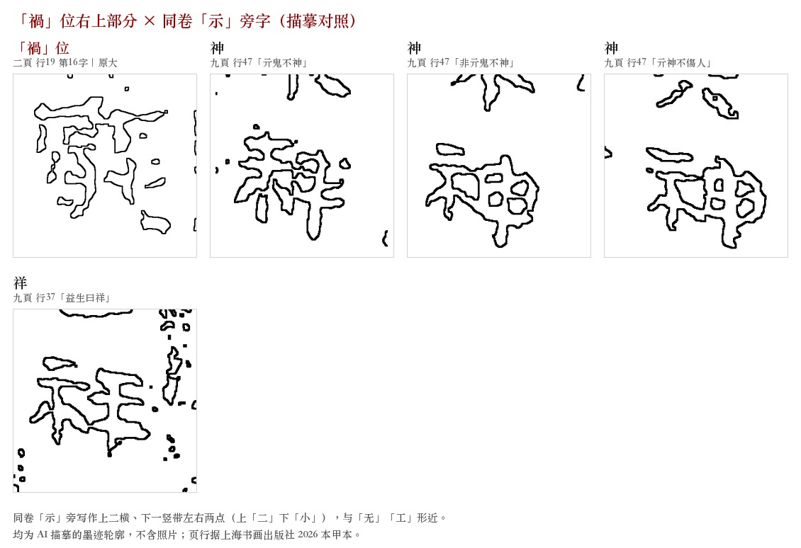
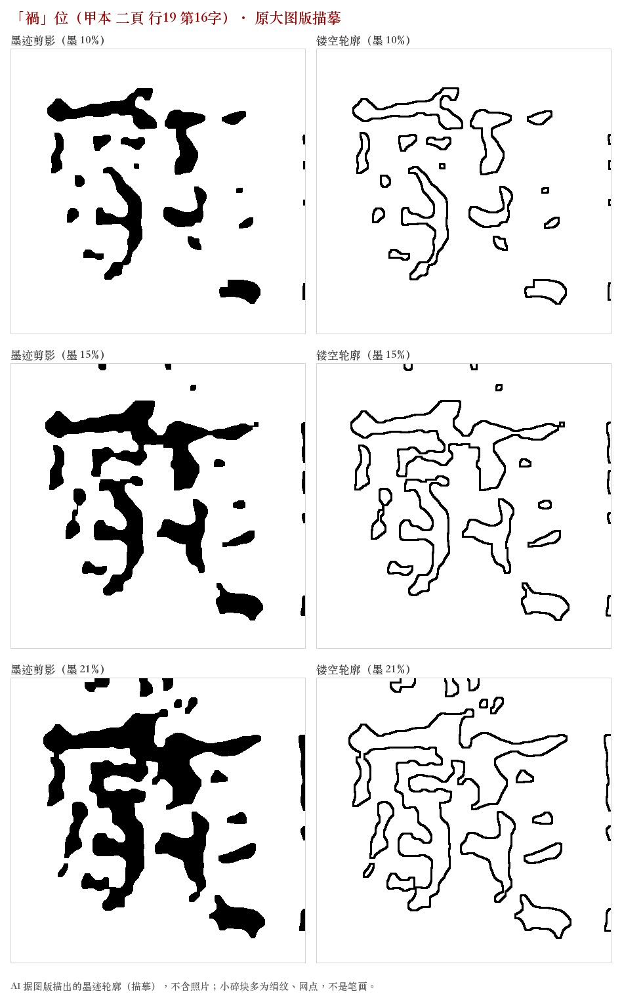
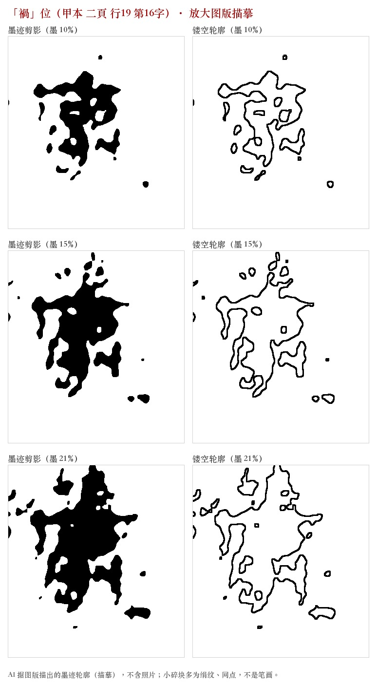
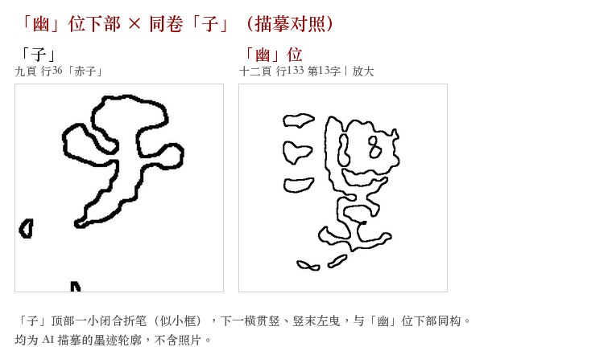
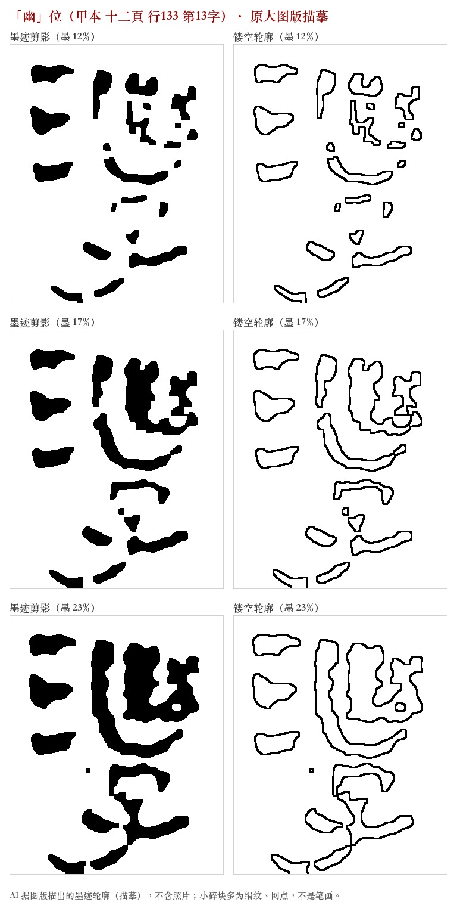
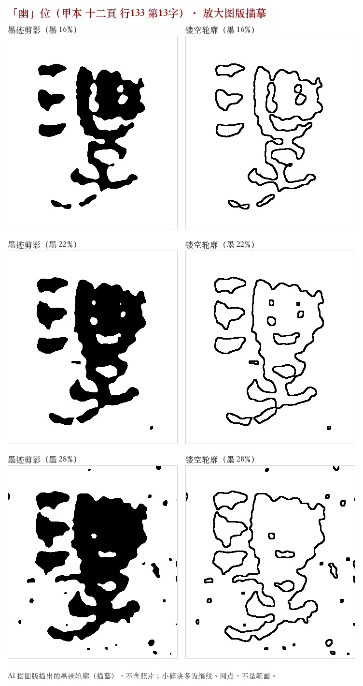

# 【请教】帛书《老子》甲本两个字的构形：「禍」右上是「无」还是「示」？「幽」里是一个「幺」还是两个？

> 🟡 **待考**。本文是作者自撰的看图记录和问题，不是定论，也不冒充权威释读。
> 章次两套并报：干昌新分章／通行本章次。页行据上海书画出版社 2026 年版甲本图版（下称「2026 本」）；**原图请看原书**。
> **图像说明**：本文**不收录任何出版物图版照片**。文中图片全部是 AI 依据图版描出的墨迹剪影与镂空轮廓（描摹），只表现两千多年前帛书上的字形，只描墨迹、不判字；小碎块多为绢纹、网点，不是笔画。
> 本仓库的许可只覆盖作者原创的文字与描摹图，不涉及 2026 本或其他出版物的任何内容。文中对干昌新著作只引用部件描述，不涉及其释义主张。如有权利人认为本文有不当之处，请在下方留言或联系作者，将及时处理。

干昌新先生在《破译〈老子〉祖本》中把帛书《老子》里的 29 个字认作「老子自创字」，并给出构形。我们逐字对照图版时，有两个字看到的结构和干氏所记的布局不太一样，自己定不下来，想请大家一起看图。

## 问题一：「禍」字（德经第 13 章「知足恒足」／通行本第 46 章）

位置：甲本 二頁 行19 第16字，「罪莫大於可欲，□莫大於不知足」中的「禍」位。干氏记作 `⿱禍心`（「禍」下加「心」）。

我们看到的：
- 字分左右两部分。原先以为顶上有一道长横贯通全字，细看应是左右两部各自的第一笔在墨晕里连上了。
- 左边是「咼」。
- 右边下部是「心」（右下那团较重的墨）。
- **右边上部像「无」，也像「工」，定不下来。**

两种读法：

| | 构形 | 理由 |
|---|---|---|
| **A** | `⿰咼⿱无心`（左咼，右上无、右下心） | 2026 本的整理释文（排印本，非图版）在这里、以及「禍莫大於無適」（德经第 50 章「哀者胜」／通行本第 69 章，甲本 七頁 行72 末）两处，都排印同一个特制字，右上即「无」 |
| **B** | `⿰咼⿱示心`（左咼，右上示、右下心） | 同卷「示」旁写作上两横、下一竖带两点，跟「无」「工」很像（见下图）。若右上是「示」，整个字就是「禍」的「示」「咼」左右换位，「心」只在「示」下面 |

（「神」：德经第 33 章／通行本第 60 章，甲本 九頁 行47；「祥」：德经第 27 章／通行本第 55 章，甲本 九頁 行37。）

描摹（每张三行＝三档墨迹深浅阈值；每行：墨迹剪影｜镂空轮廓。阈值低会断笔、高会粘连，请对照着看）：

## 问题二：「幽」字（道经第 29 章「孔德之容」／通行本第 21 章）

位置：甲本 十二頁 行133 第13字，「中有物呵，□呵鳴呵」中的「幽」位。干氏释为从水、从乚、从幺、从子（《破译》p.143），构形记作 `⿰氵⿳乚幺子`（乚、幺、子上中下三层）。

我们看到的：
- 左边「氵」（三点）。
- 右下是「子」：顶上一个小闭合折笔（像小框），下面一横穿过竖笔，竖笔末端向左长长拖出——跟同卷「赤子」的「子」（德经第 26 章「含德赤子」／通行本第 55 章，甲本 九頁 行36）同一写法（见下图）。
- 右上一笔「乚」形大弧，**从左边和下边包住**一团「幺」形墨。所以我们认为「乚」不是在最上一层，而是半包围——这是和干氏「上中下三层」不同的地方。
- **问题：「乚」里面是一个「幺」，还是两个？** 墨团右边另有一小团，像「口」又像「幺」，墨晕粘在一起，看不清笔画。

| | 构形 | 理由 |
|---|---|---|
| **A** | `⿰氵⿱⿺乚𢆶子`（乚 包两个幺，下面是子） | 和「幽」同构：「幽」是「山」包两个「幺」，这里外框写成了「乚」；释文本字正读「幽」 |
| **B** | `⿰氵⿱⿺乚幺子`（乚 包一个幺，下面是子） | 右边那一小团笔画认不出，可能只是墨晕 |

## 想请教的

1. 问题一选 A、B，还是另有看法？问题二选 A、B，还是另有看法？
2. 如果知道其他出土文献（郭店、北大汉简、银雀山等）或字书里有同类写法，请给出可以核对的出处（书名、页码或简号）。
3. 看图时请尽量把「图上实际看得见的笔画」和「据此推测的构形」分开说。

欢迎直接在讨论区回复。我们会把有出处的意见记下来，最终怎么定由作者本人判断，并会注明采纳了谁的意见。
