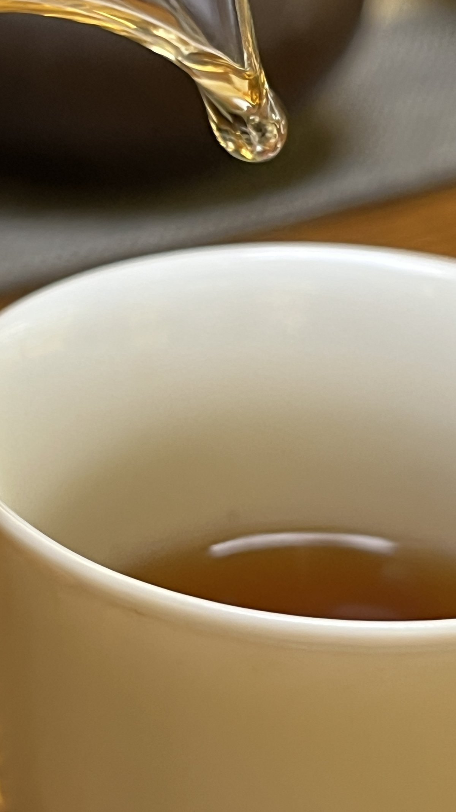
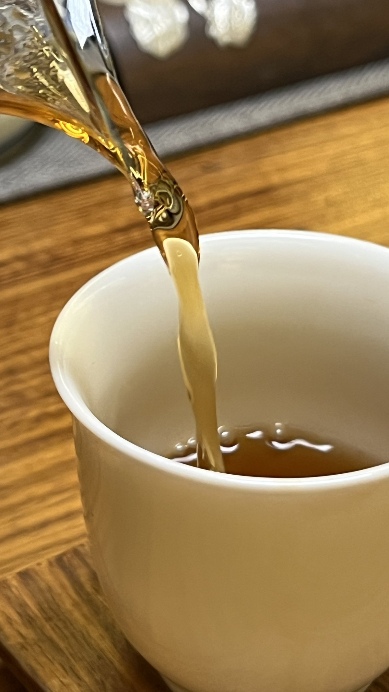
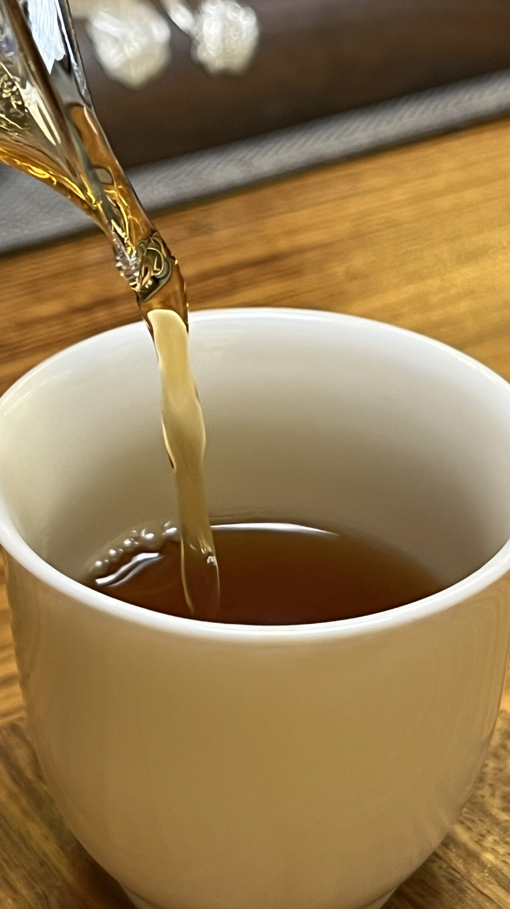
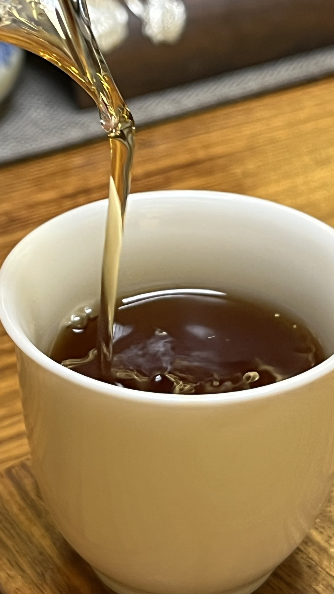
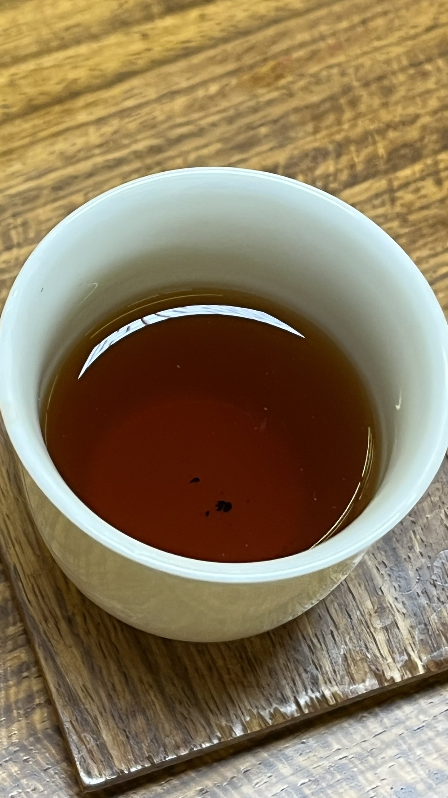

# 品古树茶 · 逐次记录
# Old-Tree Tea · Session-by-Session Log

> ⚠️ **开篇必读 · READ FIRST**
>
> 这是一份**个人逐次品饮观察记录**，记录"我喝了什么、身体当时是什么反应"，
> **不是诊疗建议，不开方子，不作功效承诺，也不推荐任何茶品、商家或购买渠道。**
> 茶品信息之所以要写清楚，**是为了让观察可被复核**——不是为了推荐。
> 每个人体质不同，照搬他人经验可能不适合自己。疾病请看执业医生／中医师辨证。

> **知识坐标**（见 [`docs/MODEL-知识模型.md`](../docs/MODEL-知识模型.md)）：本篇为 **E4**——
> 具名个人的亲身观察，**n＝1、无对照**。
> ⛔ **它能支持的只有「某个人在某次喝茶后记录到什么」，不能支持任何"有效/无效"的结论。**

---

## 一、这份记录和已有那篇茶记录的分工

本仓已有 [`茶与食物属性-实践记录.md`](茶与食物属性-实践记录.md)，**两篇分工明确，互不重复**：

| | 已有篇 | **本篇** |
|---|---|---|
| 性质 | **回顾性框架篇** | **前瞻性逐次日志** |
| 内容 | 十年概括、食物五性属性观、「古树茶的体会／不同工艺体感／茶与修心」三节定性体会 | **单场次结构化观察**，按时间累积 |
| 时间方向 | 回望 | **向前** |
| 本次是否改动 | ❌ 不动 | ✅ 从今日起累积 |

> **属性观、方法论、十年心得都在已有篇，本篇不重述**——只记录逐次数据。
> 需要框架时请回读那一篇。

## 二、为什么现在开始

**这是本仓唯一"晚一天就永久少一天"的东西。**

原创分析、模型、文章，什么时候写都能写；**时间序列不行——它只能靠时间长出来，追不上。**
辟谷、素食、茶（框架）都已有十年尺度的记录，**唯独逐次观察这一格是空的**。
所以本篇**今日建立，即使第一条还没填**。

---

## 三、记录规则

1. **树龄与山头一律标注「据售方陈述，未独立核实」。**
   ⚠️ **这是本篇最要紧的一条规则。** "三百年古树""某某山头"在市场上普遍是**商业声称**，
   买家无从核实。若把它当既定事实写下，几年后整份数据的元数据都是不可靠的。
   **这与本仓「不编造出处」是同一条纪律，只是对象从文献换成了茶。**
2. **主观强度一律用 0–5 分级，不用百分比**——避免伪精确。
3. **当日混杂变量必填**（睡眠、上一餐间隔、其他咖啡因来源等）。
   **不填这几项，当次记录基本没有解释价值**——因为分不清是茶的作用还是别的。
4. **结论栏留空。** 起步阶段**只积累观察，不下结论**；样本不够时的"规律"多半是错觉。
5. **不适、无变化、走偏，一样要记。** 只记"好的那次"，等于自己给自己制造幸存者偏差。
6. **不写品牌推荐、价格、购买渠道**（见 [`TEMPLATE.md`](TEMPLATE.md)「不适合收录」条）。

---

## 四、观察维度（本篇的字段定义）

### A · 场次
日期 ／ 时间 ／ 当日第几次饮茶

### B · 茶品（客观信息，可核部分与不可核部分分开写）
- 名称、产区／山头 **〔据售方陈述〕**
- 树龄 **〔据售方陈述，未独立核实〕**
- 年份、工艺（生普／熟普／白茶／老生茶／其他）、仓储

### C · 冲泡
器具 ／ 水 ／ 水温 ／ 投茶量 ／ 第几道

### D · 身体反应（0–5）
体感区域 ／ 温或凉 ／ 出汗 ／ 心跳变化 ／ 口腔回甘与生津 ／ **饥饿感变化** ／ 二便

### E · 当日混杂变量（必填）
睡眠时长 ／ 上一餐间隔 ／ **当日其他咖啡因来源** ／ 运动 ／ 情绪基线（0–5）

### F · 时间点
饮后 **15 / 30 / 60 / 120 分钟** 各记一次（能记几次记几次，缺了就写缺）

---

## 五、单次记录格式（复制这一块使用）

```markdown
### YYYY-MM-DD · 第 N 次

| 项 | 内容 |
|---|---|
| 茶品 | 　 |
| 产区/山头 | 　〔据售方陈述〕 |
| 树龄 | 　〔据售方陈述，未独立核实〕 |
| 年份 / 工艺 / 仓储 | 　 |
| 冲泡（器具/水/水温/投茶量/道数） | 　 |
| 睡眠时长 | 　 |
| 上一餐间隔 | 　 |
| 当日其他咖啡因来源 | 　 |
| 运动 | 　 |
| 情绪基线（0–5） | 　 |

**身体反应（0–5）**

| 时间点 | 体感区域 | 温/凉 | 出汗 | 心跳 | 回甘生津 | 饥饿感 | 备注 |
|---|---|---|---|---|---|---|---|
| 饮后 15 分 | 　 | 　 | 　 | 　 | 　 | 　 | 　 |
| 饮后 30 分 | 　 | 　 | 　 | 　 | 　 | 　 | 　 |
| 饮后 60 分 | 　 | 　 | 　 | 　 | 　 | 　 | 　 |
| 饮后 120 分 | 　 | 　 | 　 | 　 | 　 | 　 | 　 |

**当次异常或走偏**：

**结论**：（留空——起步阶段不下结论）
```

---

## 六、记录正文

> **观察内容一律由本人亲自记录。**
> ⛔ **任何代写的体感、任何示例数据，都会让这份 E4 失去全部价值**（伪造的观察比没有观察更糟）。
> 下方各条中，**客观项（茶品、日期、汤色照片）可由维护流程代录；体感各栏一律留空待本人填**。

### 2026-07-31（周五）晚 · 第 1 次

**茶品**

| 项 | 内容 |
|---|---|
| 名称 | 2006 年 云南古树茶原料 · 普洱**熟茶**（属黑茶类） |
| 来历 | **云南省茶叶科学研究所当年的试验制作** |
| 产区／山头 | 云南　〔据持有方陈述〕 |
| 树龄 | 古树　〔据持有方陈述，未独立核实〕 |
| 年份 | 2006　〔据持有方陈述〕 |
| 工艺 | 熟茶（渥堆发酵） |
| 仓储 | 　 |

> ⚠️ **「2006 年」「古树」「茶科所试验制作」三项均为陈述，本仓未做独立核实**——
> 按本篇第三节第 1 条，**这类信息记录为「据陈述」，不作为既定事实**。
> 老茶的年份与来历在市场上尤其难核，**这不是怀疑，是让几年后的数据仍然可读**。

**冲泡**

| 项 | 内容 |
|---|---|
| 器具 | 　（待填） |
| 水 / 水温 | 　（待填） |
| 投茶量 | 　（待填） |
| 记录到第几道 | 　（待填） |

**汤色**（当晚实拍，未调色）

| | |
|---|---|
|  |  |
|  |  |



**汤色描述（据照片可见，属客观项）**：注汤时汤柱透亮呈琥珀金；
入杯静置后汤色转为**深琥珀偏红、清澈见底、油光明显**，杯壁挂汤，无浑浊。

**当日混杂变量（必填，待本人填）**

| 项 | 内容 |
|---|---|
| 睡眠时长 | 　 |
| 上一餐间隔 | 　 |
| 当日其他咖啡因来源 | 　 |
| 运动 | 　 |
| 情绪基线（0–5） | 　 |

**身体反应（0–5）　⬅ 本表一律由本人填写**

| 时间点 | 体感区域 | 温/凉 | 出汗 | 心跳 | 回甘生津 | 饥饿感 | 备注 |
|---|---|---|---|---|---|---|---|
| 饮后 15 分 | 　 | 　 | 　 | 　 | 　 | 　 | 　 |
| 饮后 30 分 | 　 | 　 | 　 | 　 | 　 | 　 | 　 |
| 饮后 60 分 | 　 | 　 | 　 | 　 | 　 | 　 | 　 |
| 饮后 120 分 | 　 | 　 | 　 | 　 | 　 | 　 | 　 |

> ⚠️ **晚间饮用**——按本篇第七节，茶含咖啡因，**当晚入睡情况值得一并记一笔**（若有影响，记在「备注」）。

**当次异常或走偏**：

**结论**：（留空——起步阶段不下结论）

<!-- DEBT: type=gap | ref=第1次记录 体感与冲泡各栏 | opened=2026-08-01 | note=2026-07-31 那次品饮的客观项与汤色照片已录入，体感、冲泡参数、当日混杂变量三部分空缺，须由本人补填。禁止代写 -->

---

## 七、⚠️ 边界

- 本篇**不作功效断言**，不写"某茶通某经络""某茶治某病"；
- **不推荐茶品、商家、价格、渠道**；
- 茶含咖啡因：**下午与晚间饮用可能影响入睡**，相关一般性说明见 [`navigation/sleep.md`](../navigation/sleep.md)；
- 有心脏疾病、焦虑障碍、胃部疾病、孕期哺乳期、正在服药者，**请先咨询医生**；
- **出现心悸、明显不适、持续失眠**，应停止并就医——**不要把不适当作"茶气在起作用"**。

## 八、与本项目的关系

- **坐标**：E4（个人观察）。与 [`docs/AWARENESS-觉知与六触.md`](../docs/AWARENESS-觉知与六触.md) 所说"注意力回到当下体感"同一条线；
- **将来可能被谁引用**：[`faq/why-restless-when-still.md`](../faq/why-restless-when-still.md) 第 3.2 节有一条 **M4「咖啡因放大静止时躁动」**——
  本篇「当日其他咖啡因来源」一栏累积够了之后，**可为那条提供本仓自己的观察线索**；
- ⛔ **但本篇不能填补该页「E4（静坐）＝ 空」那一格。**
  「禅茶一味」是 **E2c**（禅门主张，体验层面的同一），**不等于两者可作同一份观察数据**；
  按核心原则二，**传统主张不会把茶的 E4 升级成静坐的 E4**。那个缺口继续留着。

---

> 本篇不作真伪裁断，不提供医疗建议，不推荐任何茶品或商家。
> 相关：[`茶与食物属性-实践记录.md`](茶与食物属性-实践记录.md)（框架篇） · [`docs/MODEL-知识模型.md`](../docs/MODEL-知识模型.md)
> 建立：2026-07-31。**记录进行中：已 1 次，尚无长期数据。**

<!-- OBSERVED: 2026-07-31 -->
<!-- ↑ 新增一条观察条目时，请把上面的日期改成当天。第1次品饮 2026-07-31；此后每新增一条观察，把上面的日期改成当天。此字段决定 HEALTH.md 的「静默天数」——git 提交时间不作数，因为改错别字也会把它清零。 -->
